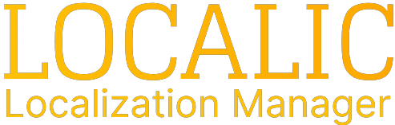
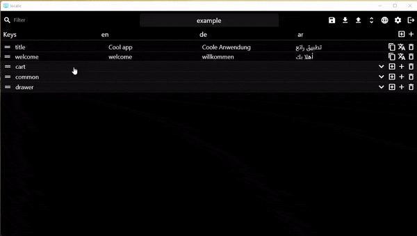
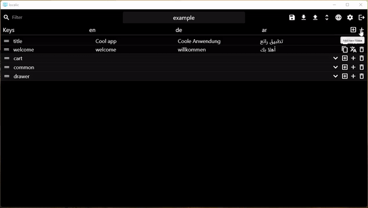
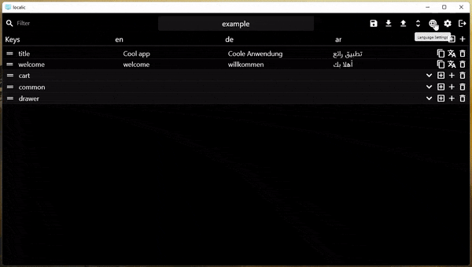
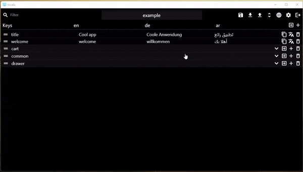
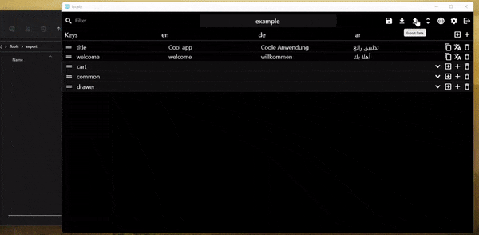

This app will help you manage you applications locals easily. group you locals, translate them and then export them ready to use in your project.

## [Online version](https://localic.netlify.app)
## Features

### Organize your locals in one big tree structure.

### Translate them with google Translator to any language you want

### Add new languages to your app

### Darg and drop your locals to rearrange them.

### Export your local to [GetX](#getx) or [Easy-localization](#easy-localization)

### Auto save and export

## Getting Started

### Windows

- launch the application
- add you first app
  - The name of you app
  - The path where to save the locals in form to reuse them later in localic (this should be in you repo files, so any update on you locals will be saved with the project). anyone have this file can use it with localic too.
  - The path where to export the generated files.
- Open the app.
- Go.

### Web

- Navigate to the page.
- Open you app
  - Add new app and the locals data will be save in the local storage so you can return to them again and you can download then at any time.
  - Import an app from the downloaded file you have.
- Go

## Data Schema

The data schema in the application is like json schema. Items and Nodes.
Every item has key and value. the value here is the translations in all defined languages.
Every Node can have many items and many node.

## Translation

you can translate the locales using google translation. you need to set the google apiKey to use it.
Only Local items can be translated. and this will translate only the empty locals for the selected item.

## Export

After adding all the data and translate them. you can export it and use it with [GetX](https://pub.dev/packages/get) or [EasyLocalization](https://pub.dev/packages/easy_localization)
In the AppBar click on Export and Export dialog will appear.

### Windows

You can pick the directory where the files should be exported to.
### Web

The exported files will be downloaded.

### GetX

To export the data to file that matches [translations schema](https://github.com/jonataslaw/getx#translations)

- Chose GetX
- Pick the folder to export the class to.
- A file with name `locals.g.dart` will be generated in the folder and ready to use.

[Export example](./assets/example/export/getx/locals.g.dart)
### Easy Localization

To export the data to json files with this [structure](https://github.com/aissat/easy_localization#-installation)

- Chose easyLocalization
- Pick the folder to export the files to.
- Json files will be generated every file has the name of language and contains the translations for this language.

[Export example](./assets/example/export/easy_localization)